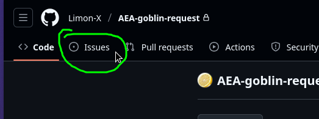
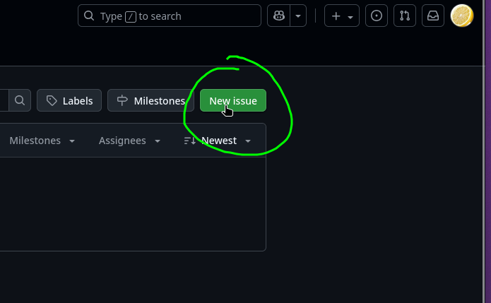

# Пример issue и форматирования находиться [тут](https://github.com/Limon-X/AEA-goblin-request/issues/1)

## Как запросить перевод:

Сверху нажимаете на Issues

Справа нажимаете на New Issue

Справа нажмите на Labels и выберите нужную метку:
- Если предлагаете новый перевод то выбираете "request", "new" и фракцию
- Если предлагаете передалть перевод то выбираете "request", "refined" и фракцию
- Добавить скриншот оригинального юнита/здания/ивента (Опционально)

В названии проблемы(issue) пишите юнита/постройки/ивента на русском (если нету оффициальной локализации то пишите английское название)

В описаниие проблемы(issue) пишите оригинальное название юнита/постройки/ивента, оригинальное описание юнита/постройки/ивента.

А затем ваше переведённое название юнита/постройки/ивента и ваше переведённое описание юнита/постройки/ивента.

После этого можете закрывать проблему нажав на Create снизу.

### Важно

В ваш перевод могут вноситься правки!

> напоминание что в переводе должны быть ихихихихиххихи
